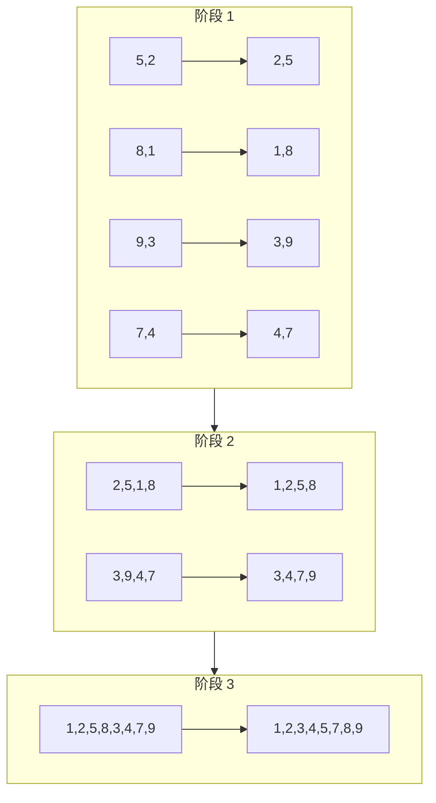

# Bitonic Sort 算法

GPU 加速的 Bitonic Sort 的详细实现。

## 算法概述

Bitonic sort 是一种基于比较的并行排序算法。**bitonic 序列**是指先单调递增然后单调递减（或反之）的序列。

### 复杂度

- **时间**：O(n log²n)
- **空间**：O(1) - 原地排序
- **并行性**：高度可并行

### 算法阶段

```
阶段 1：创建长度为 2 的 bitonic 序列
阶段 2：创建长度为 4 的 bitonic 序列
阶段 3：创建长度为 8 的 bitonic 序列
...
阶段 log₂(n)：最终排序序列
```

## 可视化解释



## WGSL 实现

### 比较与交换

```wgsl
// Compare and swap operation
fn compare_and_swap(i: u32, j: u32, ascending: bool) {
  let a = data[i];
  let b = data[j];

  if ((a > b) == ascending) {
    data[i] = b;
    data[j] = a;
  }
}
```

### 局部排序（workgroup 内）

```wgsl
@compute @workgroup_size(256)
fn bitonic_sort_local(
  @builtin(global_invocation_id) global_id: vec3<u32>,
  @builtin(local_invocation_id) local_id: vec3<u32>
) {
  let idx = global_id.x;
  let local_idx = local_id.x;

  // Load data into shared memory
  if (idx < uniforms.total_size) {
    shared_data[local_idx] = data[idx];
  } else {
    shared_data[local_idx] = 0xFFFFFFFFu;  // Max value for padding
  }

  workgroupBarrier();

  // Perform bitonic sort within workgroup
  for (var stage: u32 = 0u; stage < 8u; stage++) {
    for (var pass: u32 = stage + 1u; pass > 0u; pass--) {
      let pair_distance = 1u << (pass - 1u);
      let block_size = 1u << (stage + 1u);
      let partner = local_idx ^ pair_distance;

      if (partner > local_idx && partner < WORKGROUP_SIZE) {
        let ascending = ((local_idx / block_size) % 2u) == 0u;
        let a = shared_data[local_idx];
        let b = shared_data[partner];

        if ((a > b) == ascending) {
          shared_data[local_idx] = b;
          shared_data[partner] = a;
        }
      }

      workgroupBarrier();
    }
  }

  // Write back to global memory
  if (idx < uniforms.total_size) {
    data[idx] = shared_data[local_idx];
  }
}
```

### 全局排序（跨 workgroup）

```wgsl
@compute @workgroup_size(256)
fn bitonic_sort_global(
  @builtin(global_invocation_id) global_id: vec3<u32>
) {
  let idx = global_id.x;

  if (idx >= uniforms.total_size) { return; }

  let pair_distance = 1u << uniforms.pass_num;
  let block_size = 1u << (uniforms.stage + 1u);
  let partner = idx ^ pair_distance;

  if (partner > idx && partner < uniforms.total_size) {
    let ascending = ((idx / block_size) % 2u) == 0u;
    let a = data[idx];
    let b = data[partner];

    if ((a > b) == ascending) {
      data[idx] = b;
      data[partner] = a;
    }
  }
}
```

## TypeScript 实现

```typescript
export class BitonicSorter {
  private pipelineLocal: GPUComputePipeline;
  private pipelineGlobal: GPUComputePipeline;
  private bindGroupLayout: GPUBindGroupLayout;
  private uniformBuffer: GPUBuffer;

  async sort(data: Uint32Array): Promise<SortResult> {
    const startTime = performance.now();

    // Pad to power of 2
    const paddedSize = nextPowerOf2(data.length);
    const padded = new Uint32Array(paddedSize);
    padded.set(data);

    // Create GPU buffer
    const dataBuffer = this.createStorageBuffer(padded);

    // Calculate stages
    const numStages = Math.log2(paddedSize);
    const localStages = Math.log2(WORKGROUP_SIZE);

    // Step 1: Local sort within workgroups
    this.updateUniforms(0, 0, paddedSize);
    this.dispatchLocalSort(Math.ceil(paddedSize / WORKGROUP_SIZE));

    // Step 2: Global merge stages
    for (let stage = localStages; stage < numStages; stage++) {
      for (let pass = stage; pass >= 0; pass--) {
        this.updateUniforms(stage, pass, paddedSize);
        this.dispatchGlobalSort(paddedSize / 2);
      }
    }

    // Read back results
    const result = await this.readBuffer(dataBuffer, data.byteLength);
    const endTime = performance.now();

    return {
      sortedData: result.slice(0, data.length),
      gpuTimeMs: endTime - startTime,
      totalTimeMs: endTime - startTime,
    };
  }
}
```

## 性能特征

| 数组大小  | GPU 通道数 | 内存访问次数 |
| --------- | ---------- | ------------ |
| 256       | 64         | 16,384       |
| 1,024     | 100        | 102,400      |
| 65,536    | 256        | 16,777,216   |
| 1,048,576 | 400        | 419,430,400  |

## 最佳实践

### 1. 2 的幂次大小

Bitonic sort 在 2 的幂次大小的数组上工作效率最高：

```typescript
// Good: Power of 2
const data = new Uint32Array(65536);

// Requires padding: Not power of 2
const data = new Uint32Array(100000);
// Library automatically pads to 131072
```

### 2. 复用 GPU 上下文

创建一次上下文并复用它：

```typescript
// ✅ Good: Reuse context
const gpu = new GPUContext();
await gpu.initialize();
const sorter = new BitonicSorter(gpu);

for (const data of datasets) {
  await sorter.sort(data);
}

gpu.destroy();

// ❌ Bad: Create context for each sort
for (const data of datasets) {
  const gpu = new GPUContext();
  await gpu.initialize();
  const sorter = new BitonicSorter(gpu);
  await sorter.sort(data);
  gpu.destroy();
}
```

### 3. 批处理

依次排序多个数组：

```typescript
const results = [];
for (const data of dataArray) {
  results.push(await sorter.sort(data));
}
```

## 局限性

1. **2 的幂次填充**：非 2 的幂次的数组需要填充
2. **不稳定**：相等的元素可能被重排
3. **内存开销**：需要分配 GPU 缓冲区

## 另请参阅

- [Radix Sort 算法](/algorithm-radix)
- [架构](/architecture)
- [性能基准](/performance)
