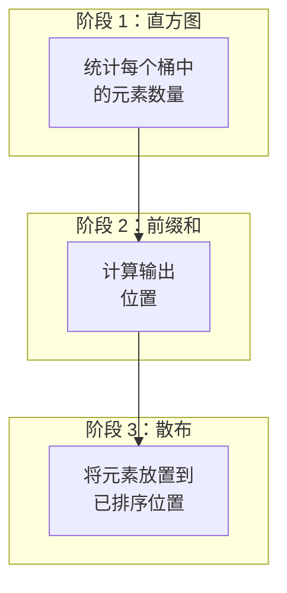

# Radix Sort 算法

GPU 加速的 Radix Sort 的详细实现。

## 算法概述

Radix sort 是一种非比较排序算法，它逐位（或逐比特）处理整数。

### 复杂度

- **时间**：O(n × k)，其中 k = 数字位数
- **空间**：O(n) - 需要辅助数组
- **稳定性**：稳定排序

### 我们的实现

- **基数**：16（2⁴ = 16 个桶）
- **每趟位数**：4
- **总趟数**：8（针对 32 位整数）

## 算法阶段


## 各阶段详情

每一趟由三个操作组成：



### 1. 直方图阶段

统计落入每个桶的元素数量：

```wgsl
const RADIX: u32 = 16u;

var<workgroup> local_histogram: array<atomic<u32>, 16>;

@compute @workgroup_size(256)
fn compute_histogram(
  @builtin(global_invocation_id) global_id: vec3<u32>,
  @builtin(local_invocation_id) local_id: vec3<u32>
) {
  // Initialize local histogram
  if (local_id.x < RADIX) {
    atomicStore(&local_histogram[local_id.x], 0u);
  }
  workgroupBarrier();

  // Count elements in local histogram
  if (global_id.x < uniforms.total_size) {
    let value = input_data[global_id.x];
    let digit = get_digit(value, uniforms.bit_offset);
    atomicAdd(&local_histogram[digit], 1u);
  }
  workgroupBarrier();

  // Write to global histogram
  if (local_id.x < RADIX) {
    let count = atomicLoad(&local_histogram[local_id.x]);
    atomicAdd(&histogram[local_id.x], count);
  }
}
```

### 2. 前缀和阶段

计算每个桶的起始位置：

```typescript
function prefixSum(histogram: Uint32Array): Uint32Array {
  const result = new Uint32Array(histogram.length);
  let sum = 0;

  for (let i = 0; i < histogram.length; i++) {
    result[i] = sum;
    sum += histogram[i];
  }

  return result;
}

// Example:
// histogram: [2, 3, 1, 0, 4, ...]
// prefixSum: [0, 2, 5, 6, 6, ...]
```

### 3. 散布阶段

将元素放置到其已排序位置：

```wgsl
@compute @workgroup_size(256)
fn scatter(
  @builtin(global_invocation_id) global_id: vec3<u32>,
  @builtin(local_invocation_id) local_id: vec3<u32>
) {
  let gid = global_id.x;

  // Load prefix sums to shared memory
  if (local_id.x < RADIX) {
    local_prefix[local_id.x] = prefix_sums[local_id.x];
    atomicStore(&local_histogram[local_id.x], 0u);
  }
  workgroupBarrier();

  if (gid < uniforms.total_size) {
    let value = input_data[gid];
    let digit = get_digit(value, uniforms.bit_offset);

    // Atomically get position within bucket
    let local_offset = atomicAdd(&local_histogram[digit], 1u);
    let global_offset = local_prefix[digit] + local_offset;

    output_data[global_offset] = value;
  }
}
```

## 数位提取

在给定偏移处提取 4 个比特：

```wgsl
fn get_digit(value: u32, bit_offset: u32) -> u32 {
  return (value >> bit_offset) & 0xFu;
}
```

| 比特偏移 | 位    | 示例值 | 数位     |
| -------- | ----- | ------ | -------- |
| 0        | 0-3   | 0xABCD | 0xD (13) |
| 4        | 4-7   | 0xABCD | 0xC (12) |
| 8        | 8-11  | 0xABCD | 0xB (11) |
| 12       | 12-15 | 0xABCD | 0xA (10) |

## 内存布局

```
对于 4 位基数的 32 位整数：
┌─────────────────┬─────────────────┬─────────────────┐
│   Input Array   │   Histogram     │  Prefix Sums    │
│   (n elements)  │  (16 integers)  │  (16 integers)  │
└─────────────────┴─────────────────┴─────────────────┘

每趟内存：
- Input buffer: n × 4 bytes
- Output buffer: n × 4 bytes
- Histogram: 16 × 4 bytes
- Prefix sums: 16 × 4 bytes
```

## TypeScript 实现

```typescript
export class RadixSorter {
  private histogramPipeline: GPUComputePipeline;
  private scatterPipeline: GPUComputePipeline;

  async sort(data: Uint32Array): Promise<SortResult> {
    const startTime = performance.now();

    // Create buffers
    const inputBuffer = this.createStorageBuffer(
      data,
      GPUBufferUsage.STORAGE | GPUBufferUsage.COPY_SRC
    );
    const outputBuffer = this.createStorageBuffer(
      data.length,
      GPUBufferUsage.STORAGE | GPUBufferUsage.COPY_DST
    );
    const histogramBuffer = this.createStorageBuffer(16, GPUBufferUsage.STORAGE);
    const prefixBuffer = this.createStorageBuffer(
      16,
      GPUBufferUsage.STORAGE | GPUBufferUsage.COPY_DST
    );

    let currentInput = inputBuffer;
    let currentOutput = outputBuffer;

    // 8 passes for 32-bit integers (4 bits per pass)
    for (let bitOffset = 0; bitOffset < 32; bitOffset += 4) {
      // Reset histogram
      this.device.queue.writeBuffer(histogramBuffer, 0, new Uint32Array(16));

      // Phase 1: Compute histogram
      this.dispatchHistogram(currentInput, histogramBuffer, bitOffset, data.length);
      await this.device.queue.onSubmittedWorkDone();

      // Phase 2: Prefix sum (on CPU for simplicity)
      const histogram = await this.readBuffer(histogramBuffer, 64);
      const prefixSums = this.computePrefixSum(new Uint32Array(histogram));
      this.device.queue.writeBuffer(prefixBuffer, 0, prefixSums);

      // Phase 3: Scatter
      this.dispatchScatter(currentInput, currentOutput, prefixBuffer, bitOffset, data.length);

      // Swap buffers
      [currentInput, currentOutput] = [currentOutput, currentInput];
    }

    // Read result (now in input buffer after odd number of swaps)
    const result = await this.readBuffer(currentInput, data.byteLength);
    const endTime = performance.now();

    return {
      sortedData: result,
      gpuTimeMs: endTime - startTime,
      totalTimeMs: endTime - startTime,
    };
  }
}
```

## 性能对比

| 数组大小  | Radix Sort | Bitonic Sort | 胜者    |
| --------- | ---------- | ------------ | ------- |
| 65,536    | 0.31ms     | 0.28ms       | Bitonic |
| 262,144   | 0.89ms     | 0.94ms       | Radix   |
| 1,048,576 | 2.8ms      | 3.2ms        | Radix   |
| 4,194,304 | 10.5ms     | 12.1ms       | Radix   |

::: tip 何时使用 Radix Sort
Radix sort 擅长处理**大型整数数组**（≥ 250K 个元素）。对于较小的数组或非整数数据，Bitonic sort 可能更合适。
:::

## 优化：GPU Prefix Sum

当前实现使用**基于 GPU 的 Blelloch scan**来计算 prefix sum，从而消除排序过程中 CPU↔GPU 的数据传输。

### Blelloch Scan 算法

Blelloch scan 是一种工作高效的并行 prefix sum 算法，总工作量为 O(n)：

```
输入：[3, 1, 7, 0, 4, 1, 6, 3]
输出（exclusive）：[0, 3, 4, 11, 11, 15, 16, 22]

阶段 1：上扫（Reduce）
  [3, 1, 7, 0, 4, 1, 6, 3]
         ↓ 两两求和
  [3, 4, 7, 7, 4, 5, 6, 9]
         ↓ stride = 4
  [3, 4, 7, 11, 4, 5, 6, 14]
         ↓ stride = 8
  [3, 4, 7, 11, 4, 5, 6, 25]  ← 总和

阶段 2：下扫（Distribute）
  [3, 4, 7, 11, 4, 5, 6, 0]   ← 清空最后一个
         ↓ stride = 4
  [3, 4, 7, 4, 4, 5, 11, 14]
         ↓ stride = 2
  [3, 0, 7, 4, 4, 3, 11, 9]
         ↓ stride = 1
  [0, 3, 4, 11, 11, 15, 16, 22]  ← exclusive scan
```

### WGSL 实现

```wgsl
@compute @workgroup_size(256)
fn blelloch_scan(
  @builtin(global_invocation_id) global_id: vec3<u32>,
  @builtin(local_invocation_id) local_id: vec3<u32>,
  @builtin(workgroup_id) workgroup_id: vec3<u32>
) {
  // Load data to shared memory
  // Phase 1: Up-sweep (reduce)
  // Phase 2: Down-sweep (distribute)
  // Write results
}
```

### 针对大型直方图的两级 Scan

对于单个 workgroup 无法处理的大型直方图（每个 workgroup 512 个元素）：

```
级别 1：每个 workgroup 内的局部 scan
级别 2：对块求和结果进行 scan
级别 3：将块前缀加到每个 workgroup 的结果上
```

### 性能影响

| 数组大小 | CPU Prefix Sum | GPU Prefix Sum | 提升     |
| -------- | -------------- | -------------- | -------- |
| 65K      | 0.5ms/pass     | 0.05ms/pass    | 快 10 倍 |
| 1M       | 2ms/pass       | 0.1ms/pass     | 快 20 倍 |
| 16M      | 30ms/pass      | 0.5ms/pass     | 快 60 倍 |

## 局限性

1. **仅支持 Uint32Array**：专用于无符号 32 位整数
2. **内存开销**：需要输入和输出缓冲区
3. **非基于比较**：无法排序任意数据类型

## 另请参阅

- [Bitonic Sort 算法](/algorithm-bitonic)
- [架构](/architecture)
- [性能基准测试](/performance)
