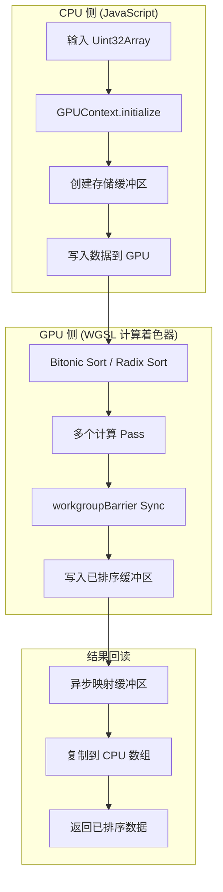
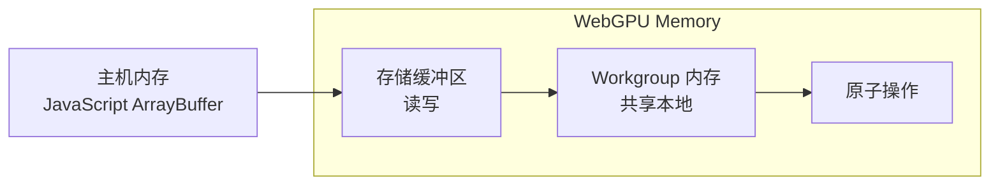

# 架构

GPU 加速排序的系统设计与数据流。

## 概览

WebGPU Sorting 使用 WGSL（WebGPU Shading Language）编写的 WebGPU 计算着色器实现了两种 GPU 加速排序算法。



## 系统架构

```
┌─────────────────────────────────────────────────────────────┐
│                          用户界面                            │
│  ┌─────────────┐  ┌─────────────┐  ┌─────────────────────┐ │
│  │ 控件        │  │ 进度        │  │ 结果显示            │ │
│  └─────────────┘  └─────────────┘  └─────────────────────┘ │
└─────────────────────────────────────────────────────────────┘
                              │
                              ▼
┌─────────────────────────────────────────────────────────────┐
│                         排序 API 层                         │
│  ┌─────────────────┐  ┌─────────────────┐  ┌─────────────┐ │
│  │ BitonicSorter   │  │ RadixSorter     │  │ Benchmark   │ │
│  └─────────────────┘  └─────────────────┘  └─────────────┘ │
└─────────────────────────────────────────────────────────────┘
                              │
                              ▼
┌─────────────────────────────────────────────────────────────┐
│                        WebGPU 核心层                         │
│  ┌─────────────────┐  ┌─────────────────┐                  │
│  │ GPUContext      │  │ BufferManager   │                  │
│  └─────────────────┘  └─────────────────┘                  │
└─────────────────────────────────────────────────────────────┘
                              │
                              ▼
┌─────────────────────────────────────────────────────────────┐
│                       WGSL 计算着色器                        │
│  ┌─────────────────┐  ┌─────────────────┐                  │
│  │ bitonic.wgsl    │  │ radix.wgsl      │                  │
│  └─────────────────┘  └─────────────────┘                  │
└─────────────────────────────────────────────────────────────┘
```

## 核心组件

### GPUContext

管理 WebGPU 设备生命周期，为 GPU 操作提供统一接口。

```typescript
class GPUContext {
  private adapter: GPUAdapter | null = null;
  private device: GPUDevice | null = null;

  static isSupported(): boolean {
    return typeof navigator !== 'undefined' && 'gpu' in navigator;
  }

  async initialize(config?: GPUContextConfig): Promise<void> {
    this.adapter = await navigator.gpu.requestAdapter({
      powerPreference: config?.powerPreference ?? 'high-performance',
    });
    this.device = await this.adapter.requestDevice();
  }

  getDevice(): GPUDevice {
    return this.device;
  }

  destroy(): void {
    this.device?.destroy();
  }
}
```

### BufferManager

处理 GPU 内存分配以及 CPU 与 GPU 之间的数据传输。

```typescript
class BufferManager {
  createStorageBuffer(data: Uint32Array): GPUBuffer {
    const buffer = this.device.createBuffer({
      size: data.byteLength,
      usage: GPUBufferUsage.STORAGE | GPUBufferUsage.COPY_SRC | GPUBufferUsage.COPY_DST,
      mappedAtCreation: true,
    });
    new Uint32Array(buffer.getMappedRange()).set(data);
    buffer.unmap();
    return buffer;
  }

  async readBuffer(buffer: GPUBuffer, size: number): Promise<Uint32Array> {
    // Create staging buffer, copy, map, and read
  }
}
```

## 数据流

### 内存模型



### 排序流水线

| 阶段 | 操作 | 内存        | 时间               |
| ---- | ---- | ----------- | ------------------ |
| 1    | 上传 | CPU → GPU   | O(n)               |
| 2    | 排序 | GPU Compute | O(log²n) or O(n×k) |
| 3    | 回读 | GPU → CPU   | O(n)               |

## 算法对比

| 特性            | Bitonic Sort   | Radix Sort |
| --------------- | -------------- | ---------- |
| **复杂度**      | O(n log²n)     | O(n × k)   |
| **类型**        | 基于比较       | 非比较     |
| **数据类型**    | 任意可比较类型 | 仅 Uint32  |
| **稳定性**      | 不稳定         | 稳定       |
| **适用场景**    | 通用           | 大整数     |
| **GPU Pass 数** | log²n          | k × 3      |

## 性能考量

### 何时 GPU 排序占优

GPU 排序在以下情况下更具优势：

1. **数组大小 > 65,536** —— 缓冲区传输开销被摊薄
2. **重复排序** —— GPU 上下文可复用
3. **批处理** —— 多次排序共享启动成本

### 优化技术

1. **共享内存（Workgroup 内存）**

   ```wgsl
   var<workgroup> shared_data: array<u32, 256>;
   // Much faster than global memory access
   ```

2. **合并内存访问**

   ```wgsl
   // ✅ Good: Consecutive access
   let value = data[global_id.x];

   // ❌ Bad: Strided access
   let value = data[global_id.x * stride];
   ```

3. **最小化同步**
   ```wgsl
   // Only barrier when data is shared between threads
   workgroupBarrier();
   ```

## 错误处理

```typescript
try {
  const gpu = new GPUContext();
  await gpu.initialize();
  const sorter = new BitonicSorter(gpu);
  const result = await sorter.sort(data);
} catch (error) {
  if (error instanceof WebGPUNotSupportedError) {
    // Fallback to CPU sort
    data.sort((a, b) => a - b);
  }
}
```

## 后续阅读

- [Bitonic Sort 算法](/algorithm-bitonic) - 详细实现
- [Radix Sort 算法](/algorithm-radix) - 详细实现
- [性能基准](/performance) - 实际测量
