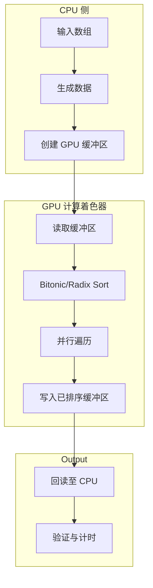

<div class="quick-stats">
  <div class="stat">
    <span class="stat-value">2</span>
    <span class="stat-label">GPU 排序器</span>
  </div>
  <div class="stat">
    <span class="stat-value">1</span>
    <span class="stat-label">演示演练场</span>
  </div>
  <div class="stat">
    <span class="stat-value">4</span>
    <span class="stat-label">核心验证命令</span>
  </div>
  <div class="stat">
    <span class="stat-value">1</span>
    <span class="stat-label">根更新日志</span>
  </div>
</div>

## 快速开始

```typescript
import { GPUContext, BitonicSorter } from 'webgpu-sorting';

// Initialize WebGPU context
const gpu = new GPUContext();
await gpu.initialize();

// Create sorter
const sorter = new BitonicSorter(gpu);

// Sort data on GPU
const data = new Uint32Array([5, 2, 8, 1, 9, 3, 7, 4, 6, 0]);
const { sortedData } = await sorter.sort(data);

console.log(sortedData); // [0, 1, 2, 3, 4, 5, 6, 7, 8, 9]
```

## 浏览器支持

<div class="browser-grid">
  <div class="browser-item supported">
    <div class="browser-icon">🌐</div>
    <span class="browser-name">Chrome 113+</span>
    <span class="browser-status">已支持</span>
  </div>
  <div class="browser-item supported">
    <div class="browser-icon">🌊</div>
    <span class="browser-name">Edge 113+</span>
    <span class="browser-status">已支持</span>
  </div>
  <div class="browser-item partial">
    <div class="browser-icon">🦊</div>
    <span class="browser-name">Firefox Nightly</span>
    <span class="browser-status">需要标志位</span>
  </div>
  <div class="browser-item partial">
    <div class="browser-icon">🧭</div>
    <span class="browser-name">Safari 18+</span>
    <span class="browser-status">macOS 14+</span>
  </div>
</div>

## 为何使用 GPU 排序？

当满足以下条件时，GPU 排序更具优势：

- **数组足够大** - 缓冲区上传与回读的开销被摊销
- **批量处理** - 多次排序可共享 GPU 上下文
- **实时应用** - 为可视化和仿真提供低延迟排序
- **整数密集型工作负载** - Radix sort 在 Uint32Array 数据上表现优异

使用[交互式演示](/demo)在你自己的硬件上测量交叉点，而非依赖固定的基准测试声明。

## 架构概览



在[架构](/architecture)文档中了解更多。
